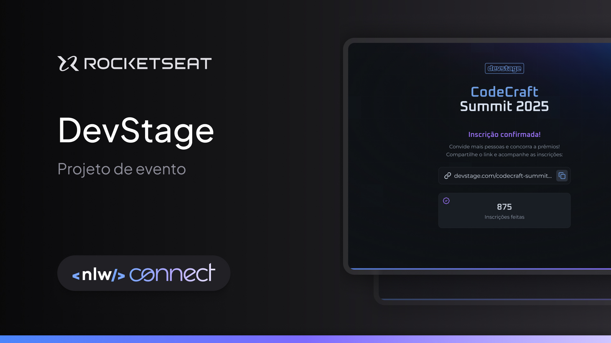

<h1 align="center"> NLWConnect </h1>

Programa exclusivo e gratuito, promovido pela Rocketseat para ensino de tecnologias WEB.  

  <a href="#-tecnologias">Tecnologias</a>     |    
  <a href="#-projeto">Projeto</a>     |    
  <a href="#-layout">Layout</a>     |    
  <a href="#memo-licença">Licença</a>

  

 

  

##  🚀 Tecnologias

Esse projeto foi desenvolvido com as seguintes tecnologias:

- HTML e CSS
- JavaScript
- Git e Github
-Figma _

##  💻 Projeto

O NLWConnect é um site de incrições e convites para eventos.

- [Visite o projeto online](https://deiversonsousa.github.io/nlw-connect/)

